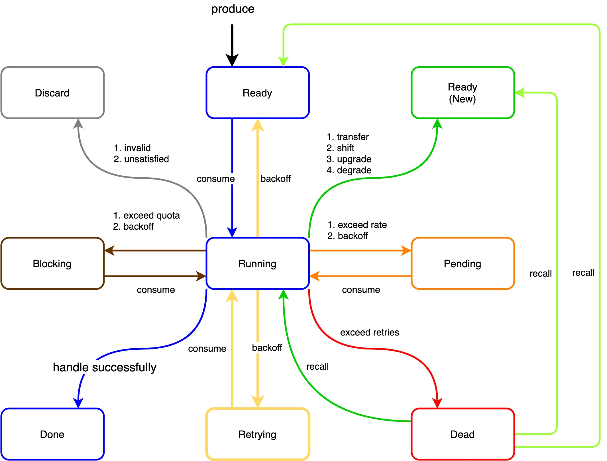
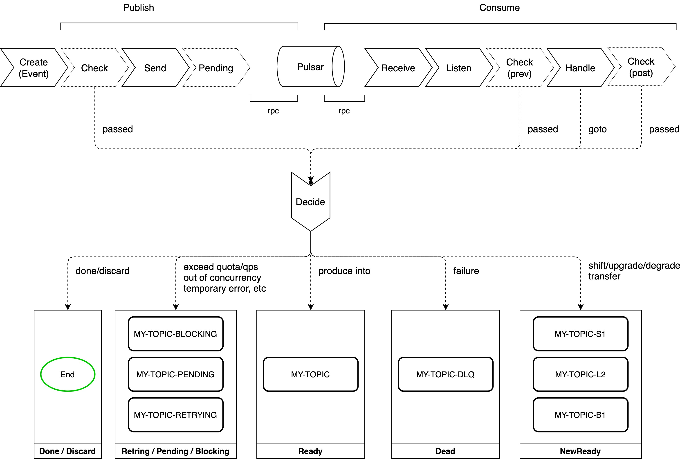
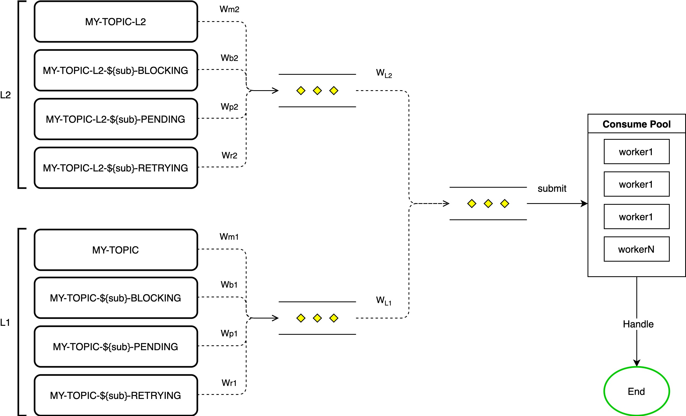

## Soften 消息客户端使用指南

### 基础使用
基本使用请参考 [soften](../README.md)

### 消息状态图
Soften模型核心是基于状态来决定一个消息的去向。以下为支持的状态以及状态扭转流程。

说明：
<table>
    <tr>
        <th>状态</th><th>解释</th><th>备注</th>
    </tr>
    <tr align="left"><th>Ready</th><th>默认状态; 业务消息发送到中间件, 可被客户端即时抓取到的状态</th><th>持久化状态</th></tr>
    <tr align="left"><th>Running</th><th>消息被中间件投递到客户端, 消费者正在处理中</th><th>非持久化状态; 中间态</th></tr>
    <tr align="left"><th>Done</th><th>消息被消费者消费处理完成, 该消息对应的业务逻辑已经处理完毕</th><th>非持久化状态; 终态</th></tr>
    <tr align="left"><th>Retrying</th><th>消息被消费者处理过且为处理没有顺利成功; 消费者期望以较低延迟进行重试</th><th>持久化状态; 中间态; 消费中转归属于订阅, 发送中转归属于主题(TODO)</th></tr>
    <tr align="left"><th>Pending</th><th>消息所属业务主体消费能力受限状态; 消费者期望以较低延迟进行重试</th><th>持久化状态; 中间态; 消费中转归属于订阅, 发送中转归属于主题(TODO)</th></tr>
    <tr align="left"><th>Blocking</th><th>消息所属业务主体消费额度受限状态; 消费者期望以较低权重和较高延迟进行重试</th><th>持久化状态; 中间态; 消费中转归属于订阅, 发送中转归属于主题(TODO)</th></tr>
    <tr align="left"><th>Dead</th><th>消息被消费者重试处理次数达到指定上限, 业务放弃对该消息的处理, 同时冷备到一个主题中</th><th>持久化状态; 终态(可召回); 消费中转归属于订阅, 发送中转归属于主题(TODO)</th></tr>
    <tr align="left"><th>NewReady</th><th>同Ready状态, 但是消息来源为业务消息消费打散、升级、降级或者转移</th><th>持久化状态; 新的主体</th></tr>
</table>

消费权重:
<table>
    <tr>
        <th>状态</th><th>默认权重</th><th>备注</th>
    </tr>
    <tr align="left"><th>Ready</th><th>10 (50%)</th><th></th></tr>
    <tr align="left"><th>Retrying</th><th>6 (30%)</th><th></th></tr>
    <tr align="left"><th>Pending</th><th>3 (15%)</th><th></th></tr>
    <tr align="left"><th>Blocking</th><th>1 (5%)</th><th></th></tr>
</table>

消息级别:
<table>
    <tr>
        <th>级别</th><th>解释</th><th>备注</th>
    </tr>
    <tr align="left"><th>L3</th><th>默认权重30</th><th>消息升降/转移后归属于主题</th></tr>
    <tr align="left"><th>L2</th><th>默认权重20</th><th>消息升降/转移后归属于主题</th></tr>
    <tr align="left"><th>L1</th><th>默认权重10</th><th>默认；消息升降/转移后归属于主题</th></tr>
    <tr align="left"><th>B1</th><th>默认权重5</th><th>消息升降/转移后归属于主题</th></tr>
    <tr align="left"><th>B2</th><th>默认权重2</th><th>消息升降/转移后归属于主题</th></tr>
    <tr align="left"><th>S3</th><th>默认权重30</th><th>消息升降/转移后归属于主题</th></tr>
    <tr align="left"><th>S2</th><th>默认权重20</th><th>消息升降/转移后归属于主题</th></tr>
    <tr align="left"><th>S1</th><th>默认权重10</th><th>消息升降/转移后归属于主题</th></tr>
</table>
说明: 
- 如同一级别包含多个订阅,其中一个订阅中发生的升降/转移,另一个订阅也订阅了升降/转移的目标主题时,需要注意是否符合预期。
- 同一业务的不同订阅均需要转移/升降时,推荐根据订阅的不同先将消息转移至订阅义务的相关的独占主题中。

### 执行流程

### 监听策略

### 检查扩展点

<table>
    <!-- header -->
    <tr>
        <th>检查阶段</th>
        <th>目标消息状态</th>
        <th>检查包装器</th>
        <th>解释</th>
    </tr>
    <!-- body -->
    <!-- produce cases -->
    <tr align="left">
        <th rowspan="5">Produce</th><th>Discard</th><th>checker.PrevSendDiscard</th><th>将消息丢弃</th>
    </tr>
    <tr align="left"><th>Dead</th><th>checker.PrevSendDead</th><th>升降消息到死信级别队列(D1,业务不期望被订阅), 明确只能到死信级别队列</th></tr>
    <tr align="left"><th>Upgrade</th><th>checker.PrevSendUpgrade</th><th>升级消息到预配置的升级级别中; 明确升级, 不能平级或降级移动</th></tr>
    <tr align="left"><th>Degrade</th><th>checker.PrevSendDegrade</th><th>降级消息到预配置的降级级别中; 明确降级, 不能平级或升级移动</th></tr>
    <tr align="left"><th>Shift</th><th>checker.PrevSendShift</th><th>升降消息到预配置的降级级别中; 任意升降, 无级别限制</th></tr>
    <tr align="left"><th>Transfer</th><th>checker.PrevSendTransfer</th><th>转移消息到检查结果指定的其他业务主体队列中</th></tr>
    <!-- consume cases -->
    <tr align="left">
        <th rowspan="8">Prev-Handle</th><th>Discard</th><th>checker.PrevHandleDiscard; checker.PostHandleDiscard</th><th>将消息丢弃</th>
    </tr>
    <tr align="left"><th>Pending</th><th>checker.PrevHandlePending; checker.PostHandlePending</th><th>路由消息到Pending队列</th></tr>
    <tr align="left"><th>Blocking</th><th>checker.PrevHandleBlocking; checker.PostHandleBlocking</th><th>路由消息到Blocking队列</th></tr>
    <tr align="left"><th>Retrying</th><th>checker.PrevHandleRetrying; checker.PostHandleRetrying</th><th>路由消息到Retrying队列</th></tr>
    <tr align="left"><th>Dead</th><th>checker.PrevHandleDead; checker.PostHandleDead</th><th>路由消息到死信队列</th></tr>
    <tr align="left"><th>Upgrade</th><th>checker.PrevHandleUpgrade; checker.PostHandleUpgrade</th><th>升级消息到预配置的升级级别中; 明确升级, 不能平级或降级移动</th></tr>
    <tr align="left"><th>Degrade</th><th>checker.PrevHandleDegrade; checker.PostHandleDegrade</th><th>降级消息到预配置的降级级别中; 明确降级, 不能平级或升级移动</th></tr>
    <tr align="left"><th>Degrade</th><th>checker.PrevHandleShift; checker.PostHandleShift</th><th>升降消息到预配置的降级级别中; 任意升降, 无级别限制</th></tr>
    <tr align="left"><th>Transfer</th><th>checker.PrevHandleTransfer; checker.PostHandleTransfer</th><th>转移消息到检查结果指定的其他业务主体队列中</th></tr>
</table>

### 高级处理定向
<table>
    <!-- header -->
    <tr>
        <th>阶段</th>
        <th>目标消息状态</th>
        <th>处理结果</th>
        <th>解释</th>
    </tr>
    <!-- body -->
    <!-- handle goto cases -->
    <tr align="left">
        <th rowspan="9">Handle</th><th>Discard</th><th>handler.GotoDiscard</th><th>将消息丢弃</th>
    </tr>
    <tr align="left"><th>Pending</th><th>handler.GotoPending</th><th>路由消息到Pending队列</th></tr>
    <tr align="left"><th>Blocking</th><th>handler.GotoBlocking</th><th>路由消息到Blocking队列</th></tr>
    <tr align="left"><th>Retrying</th><th>handler.GotoRetrying</th><th>路由消息到Retrying队列</th></tr>
    <tr align="left"><th>Dead</th><th>handler.GotoDead</th><th>路由消息到死信队列</th></tr>
    <tr align="left"><th>Upgrade</th><th>handler.GotoUpgrade or handler.GotoUpgrade.WithLevel($my-new-level)</th><th>升级消息到预配置的升级级别中; 明确升级, 不能平级或降级移动</th></tr>
    <tr align="left"><th>Degrade</th><th>handler.GotoDegrade or handler.GotoDegrade.WithLevel($my-new-level)</th><th>降级消息到预配置的降级级别中; 明确降级, 不能平级或升级移动</th></tr>
    <tr align="left"><th>Shift</th><th>handler.GotoShift or handler.GotoShift.WithLevel($my-new-level)</th><th>升降消息到预配置的降级级别中; 任意升降, 无级别限制</th></tr>
    <tr align="left"><th>Transfer</th><th>handler.GotoTransfer.WithTopic("my-new-topic")</th><th>转移消息到检查结果指定的其他业务主体队列中</th></tr>
</table>

### Prometheus 指标

<table>
    <!-- header -->
    <tr>
        <th>阶段</th>
        <th>指标</th>
        <th>类型</th>
        <th>标签</th>
        <th>解释</th>
    </tr>
    <!-- body -->
    <!-- producer -->
    <tr align="left">
        <th rowspan="10">Produce</th>
        <th>pulsar_client_messages_published</th><th>Counter</th><th>constLabels + leveledLabels</th><th>Counter of messages published by the client</th>
    </tr>
    <tr align="left"><th>pulsar_client_bytes_published</th><th>Counter</th><th>constLabels + leveledLabels</th><th>Counter of messages published by the client</th></tr>
    <tr align="left"><th>pulsar_client_producer_pending_messages</th><th>Gauge</th><th>constLabels + leveledLabels</th><th>Counter of messages pending to be published by the client</th></tr>
    <tr align="left"><th>pulsar_client_producer_pending_bytes</th><th>Gauge</th><th>constLabels + leveledLabels</th><th>Counter of bytes pending to be published by the client</th></tr>
    <tr align="left"><th>pulsar_client_producer_errors</th><th>Counter</th><th>constLabels + leveledLabels</th><th>Counter of publish errors</th></tr>
    <tr align="left"><th>pulsar_client_producer_latency_seconds</th><th>Histogram</th><th>constLabels + leveledLabels</th><th>Publish latency experienced by the client (from publish time to the server response time)</th></tr>
    <tr align="left"><th>pulsar_client_producer_rpc_latency_seconds</th><th>Histogram</th><th>constLabels + leveledLabels</th><th>Publish RPC latency experienced internally by the client when sending data to receiving an ack (from peek pending time to the server response time)</th></tr>
    <tr align="left"><th>pulsar_client_producers_opened</th><th>Counter</th><th>constLabels + leveledLabels</th><th>Counter of producers created by the client</th></tr>
    <tr align="left"><th>pulsar_client_producers_closed</th><th>Counter</th><th>constLabels + leveledLabels</th><th>Counter of producers closed by the client</th></tr>
    <tr align="left"><th>pulsar_client_producers_partitions_active</th><th>Gauge</th><th>constLabels + leveledLabels</th><th>Counter of individual partitions the producers are currently active</th></tr>
    <tr align="left">
        <th rowspan="13">Produce (Soften)</th>
        <th>soften_producers_opened</th><th>Gauge</th><th>constLabels + topic</th><th>Gauge of opened producers</th>
    </tr>
    <tr align="left"><th>soften_producer_publish_success</th><th>Counter</th><th>constLabels + topic</th><th>Counter of publish success by produce deciders</th></tr>
    <tr align="left"><th>soften_producer_publish_failed</th><th>Counter</th><th>constLabels + topic</th><th>Counter of publish failed by produce deciders</th></tr>
    <tr align="left"><th>soften_producer_publish_latency_from_PCheck</th><th>Histogram</th><th>constLabels + topic</th><th>Publish latency from prev-check start time to the server response time</th></tr>
    <tr align="left"><th>soften_producer_publish_latency_from_Event</th><th>Histogram</th><th>constLabels + topic</th><th>Publish latency from event time to the server response time</th></tr>
    <tr align="left"><th>soften_producer_checkers_opened</th><th>Gauge</th><th>constLabels + topic + check_type</th><th>Gauge of opened produce checkers</th></tr>
    <tr align="left"><th>soften_producer_check_passed</th><th>Counter</th><th>constLabels + topic + check_type</th><th>Counter of check passed by produce checkers</th></tr>
    <tr align="left"><th>soften_producer_check_rejected</th><th>Counter</th><th>constLabels + topic + check_type</th><th>Counter of check rejected by produce checkers</th></tr>
    <tr align="left"><th>soften_producer_check_latency</th><th>Histogram</th><th>constLabels + topic + check_type</th><th>Check latency experienced by produce checkers</th></tr>
    <tr align="left"><th>soften_producer_deciders_opened</th><th>Gauge</th><th>constLabels + topic + goto</th><th>Gauge of opened produce deciders</th></tr>
    <tr align="left"><th>soften_producer_decide_success</th><th>Counter</th><th>constLabels + topic + goto</th><th>Counter of decide success by produce deciders</th></tr>
    <tr align="left"><th>soften_producer_decide_failed</th><th>Counter</th><th>constLabels + topic + goto</th><th>Counter of decide failed by produce deciders</th></tr>
    <tr align="left"><th>soften_producer_decide_latency</th><th>Histogram</th><th>constLabels + topic + goto</th><th>Decide latency experienced by produce deciders</th></tr>
    <tr align="left">
        <th rowspan="2">Listen (Soften)</th>
        <th>soften_listeners_opened</th><th>Gauge</th><th>constLabels + topics + levels</th><th>Gauge of opened listeners</th>
    </tr>    
    <tr align="left"><th>soften_listeners_running</th><th>Gauge</th><th>constLabels + topics + levels</th><th>Gauge of running listeners</th></tr>
    <!-- consumer -->
    <tr align="left">
        <th rowspan="11">Consume</th>
        <th>pulsar_client_consumers_opened</th><th>Counter</th><th>constLabels + leveledLabels</th><th>Counter of consumers created by the client</th>
    </tr>    
    <tr align="left"><th>pulsar_client_consumers_closed</th><th>Counter</th><th>constLabels + leveledLabels</th><th>Counter of consumers closed by the client</th></tr>
    <tr align="left"><th>pulsar_client_consumers_partitions_active</th><th>Gauge</th><th>constLabels + leveledLabels</th><th>Counter of individual partitions the consumers are currently active</th></tr>
    <tr align="left"><th>pulsar_client_messages_received</th><th>Counter</th><th>constLabels + leveledLabels</th><th>Counter of messages received by the client</th></tr>
    <tr align="left"><th>pulsar_client_bytes_received</th><th>Counter</th><th>constLabels + leveledLabels</th><th>Counter of bytes received by the client</th></tr>
    <tr align="left"><th>pulsar_client_consumer_prefetched_messages</th><th>Gauge</th><th>constLabels + leveledLabels</th><th>Number of messages currently sitting in the consumer pre-fetch queue</th></tr>
    <tr align="left"><th>pulsar_client_consumer_prefetched_bytes</th><th>Gauge</th><th>constLabels + leveledLabels</th><th>Total number of bytes currently sitting in the consumer pre-fetch queue</th></tr>
    <tr align="left"><th>pulsar_client_consumer_acks</th><th>Counter</th><th>constLabels + leveledLabels</th><th>Counter of messages acked by client</th></tr>
    <tr align="left"><th>pulsar_client_consumer_nacks</th><th>Counter</th><th>constLabels + leveledLabels</th><th>Counter of messages nacked by client</th></tr>
    <tr align="left"><th>pulsar_client_consumer_dlq_messages</th><th>Counter</th><th>constLabels + leveledLabels</th><th>Counter of messages sent to Dead letter queue</th></tr>
    <tr align="left"><th>pulsar_client_consumer_processing_time_seconds</th><th>Histogram</th><th>constLabels + leveledLabels</th><th>Time it takes for application to process messages (from receive time to invoke ack time)</th></tr>
    <tr align="left">
        <th rowspan="22">Consume (Soften)</th>
        <th>soften_consumers_opened</th><th>Gauge</th><th>constLabels + {topics, levels, topic, level, status}</th><th>Gauge of opened consumers</th>
    </tr>
    <tr align="left"><th>soften_consumer_receive_latency_from_Publish</th><th>Histogram</th><th>constLabels + {topics, levels, topic, level, status}</th><th>Publish latency from publish time to receive time</th></tr>
    <tr align="left"><th>soften_consumer_listen_latency</th><th>constLabels + {topics, levels, topic, level, status}</th><th>Histogram</th><th>Listen latency from receive time to listen time</th></tr>
    <tr align="left"><th>soften_consumer_listen_latency_from_Event</th><th>Histogram</th><th>constLabels + {topics, levels, topic, level, status}</th><th>Listen latency from event time to listen time</th></tr>
    <tr align="left"><th>soften_consumer_consume_messages_acks</th><th>Counter</th><th>constLabels + {topics, levels, topic, level, status}</th><th>Counter of message ack by consumers</th></tr>
    <tr align="left"><th>soften_consumer_consume_messages_nacks</th><th>Counter</th><th>constLabels + {topics, levels, topic, level, status}</th><th>Counter of message nack by consumers</th></tr>
    <tr align="left"><th>soften_consumer_consume_messages_escape</th><th>Counter</th><th>constLabels + {topics, levels, topic, level, status}</th><th>Counter of message escape by consumers</th></tr>
    <tr align="left"><th>soften_consumer_checkers_opened</th><th>Gauge</th><th>constLabels + {topics, levels, topic, level, status, check_type}</th><th>Gauge of opened consume checkers</th></tr>
    <tr align="left"><th>soften_consumer_check_passed</th><th>Counter</th><th>constLabels + {topics, levels, topic, level, status, check_type}</th><th>Counter of check passed by consume checkers</th></tr>
    <tr align="left"><th>soften_consumer_check_rejected</th><th>Counter</th><th>constLabels + {topics, levels, topic, level, status, check_type}</th><th>Counter of check rejected by consume checkers</th></tr>
    <tr align="left"><th>soften_consumer_check_latency</th><th>Histogram</th><th>constLabels + {topics, levels, topic, level, status, check_type}</th><th>Check latency experienced by consume checkers</th></tr>
    <tr align="left"><th>soften_consumer_handle_latency</th><th>Histogram</th><th>constLabels + {topics, levels, topic, level, status, goto}</th><th>Handle latency experienced by consume handlers</th></tr>
    <tr align="left"><th>soften_consumer_handle_messages_consumes</th><th>Histogram</th><th>constLabels + {topics, levels, topic, level, status, goto}</th><th>Consume times experienced by consume handlers</th></tr>
    <tr align="left"><th>soften_consumer_deciders_opened</th><th>Gauge</th><th>constLabels + {topics, levels, goto}</th><th>Gauge of opened consume deciders</th></tr>
    <tr align="left"><th>soften_consumer_decide_success</th><th>Counter</th><th>constLabels + {topics, levels, topic, level, status, goto}</th><th>Counter of check success by consume checkers</th></tr>
    <tr align="left"><th>soften_consumer_decide_failed</th><th>Counter</th><th>constLabels + {topics, levels, topic, level, status, goto}</th><th>Counter of decide failed by consume checkers</th></tr>
    <tr align="left"><th>soften_consumer_decide_latency</th><th>Histogram</th><th>constLabels + {topics, levels, topic, level, status, goto}</th><th>Decide latency experienced by consume deciders</th></tr>
    <tr align="left"><th>soften_consumer_decide_latency_from_Receive</th><th>Histogram</th><th>constLabels + {topics, levels, topic, level, status, goto}</th><th>Decide latency from receive time to decided time</th></tr>
    <tr align="left"><th>soften_consumer_decide_latency_from_Listen</th><th>Histogram</th><th>constLabels + {topics, levels, topic, level, status, goto}</th><th>Decide latency from listen time to decided time</th></tr>
    <tr align="left"><th>soften_consumer_decide_latency_from_LPCheck</th><th>Histogram</th><th>constLabels + {topics, levels, topic, level, status, goto}</th><th>Decide latency from listen prev-check start time to decided time</th></tr>
    <tr align="left"><th>soften_message_end_latency_from_Publish</th><th>Histogram</th><th>constLabels + {topics, levels, topic, level, status, goto}</th><th>Message end latency from publish time to end time (discard, done, dead)</th></tr>
    <tr align="left"><th>soften_message_end_latency_from_Event</th><th>Histogram</th><th>constLabels + {topics, levels, topic, level, status, goto}</th><th>Message end latency from event time to end time (discard, done, dead)</th></tr>
    <!-- reader -->
    <tr align="left">
        <th rowspan="2">Reader</th>
        <th>pulsar_client_readers_opened</th><th>Counter</th><th>constLabels + leveledLabels</th><th>Counter of readers created by the client</th>
    </tr>
    <tr align="left"><th>pulsar_client_readers_closed</th><th>Counter</th><th>constLabels + leveledLabels</th><th>Counter of readers closed by the client</th></tr>
    <!-- client -->
    <tr align="left">
        <th rowspan="7">Client</th>
        <th>pulsar_client_connections_opened</th><th>Counter</th><th>constLabels + leveledLabels</th><th>Counter of connections created by the client</th>
    </tr>
    <tr align="left"><th>pulsar_client_connections_closed</th><th>Counter</th><th>constLabels + leveledLabels</th><th>Counter of connections closed by the client</th></tr>
    <tr align="left"><th>pulsar_client_connections_establishment_errors</th><th>Counter</th><th>constLabels + leveledLabels</th><th>Counter of errors in connections establishment</th></tr>
    <tr align="left"><th>pulsar_client_connections_handshake_errors</th><th>Counter</th><th>constLabels + leveledLabels</th><th>Counter of errors in connections handshake (eg: authz)</th></tr>
    <tr align="left"><th>pulsar_client_lookup_count</th><th>Counter</th><th>constLabels + leveledLabels</th><th>Counter of lookup requests made by the client</th></tr>
    <tr align="left"><th>pulsar_client_partitioned_topic_metadata_count</th><th>Counter</th><th>constLabels + leveledLabels</th><th>Counter of partitioned_topic_metadata requests made by the client</th></tr>
    <tr align="left"><th>pulsar_client_rpc_count</th><th>Counter</th><th>constLabels + leveledLabels</th><th>Counter of RPC requests made by the client</th></tr>
    <tr align="left">
        <th rowspan="7">Client (Soften)</th>
        <th>soften_clients_opened</th><th>Gauge</th><th>constLabels + url</th><th>Gauge of opened clients</th>
    </tr>
</table>

### 管理工具
- recall 召回
- perf 测试
