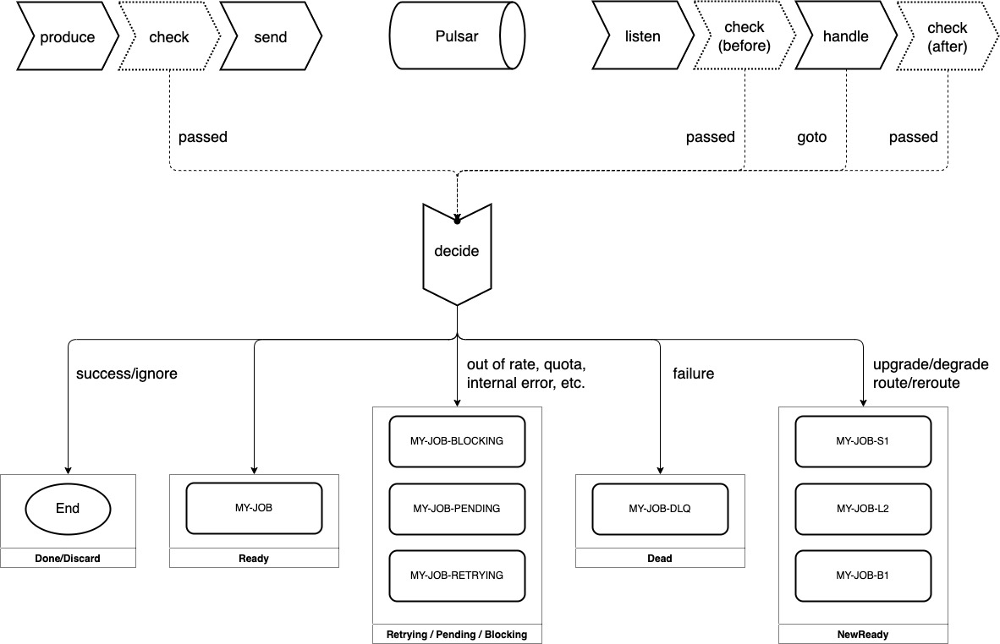

## Soften 消息客户端使用指南

### 消息状态图

### 执行流程

-----------
### 基础使用
基本使用请参考 [soften](../README.md)

### 生产者高级用法示例

#### 生产者如何跳过不需要处理的消息？

#### 生产者如果按需动态路由消息？

#### 生产这如何将消息动态发送到不同等级的主题中？

### 创建消费者

#### 简单模式

#### 多状态模式

#### 多等级模式

#### 前置检查：如何将超数独限制的消息投递到Pending队列中？

#### 处理定向：如何将5xx错误的消息投递到Retrying队列中？

#### 后置检查：如何将4xx错误的消息投递到死信队列中？

