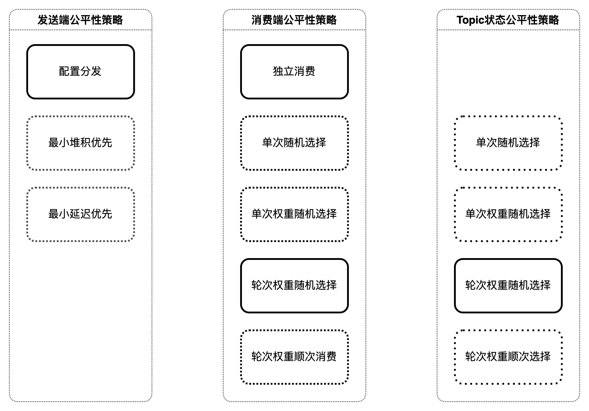

## 基于状态的可调谐消息处理客户端

### 重构背景
##### KODO异步系统核心能力
|能力或需求|当前状态|重构方案|期望状态|
|:----|:----|:----|:----|
|高吞吐量，低延迟，高可用|少量用户消息消费耗时长时，影响整体吞吐；部分延迟低，最差达数天，甚至需要手动丢弃消息|接入Pulsar + 基于状态的消息模型 + 消息隔离策略 + 动态重路由|延迟相对稳定且大幅缩短|
|平滑无限制的扩容，缩容|redis容量受内存限制|Pulsar存储与计算分离，Broker可无限平滑扩容; BK扩容相对麻烦，也可以做到无限扩容|支持|
|消息不丢失|重试超上限未处理成功的消息，丢失|引入死信队列 + 手动召回死信消息|不丢失|
|消息基本不重复|kafka维护offset时，如果异常重启，消息非预期重复|消息单条确认，不累积确认； 统一封装消息状态，通过公共库控制接入客户端细节|基本不重复|

##### KODO异步系统特色能力支持
|能力或需求|当前状态|重构方案|期望状态|
|:----|:----|:----|:----|
|Bucket级别的消息公平性|不完整|引入消息状态机制，分离各状态的消息存储，差异化各状态消息的延迟间隔，差异化各状态的消息并发比重|基本非绝对公平,支持手动干预升降级，甚至独享|
|Bucket级别的隔离性|不完整|对uid/bucket进行配置,统一方式、统一数据源|支持,非绝对隔离|
|状态级别的隔离性|不支持|消费模型可基于消息状态做并发隔离、限额隔离、重试隔离|支持,可完全隔离|
|Bucket级别的路由定制|不支持|消息分发时，获取配置化的路由策略，基本解决数据倾斜和消息互扰|支持，可选|
|Bucket级别的重路由定制|不支持|消息消费时，通过SDK统一对各状态进行重定向探测路由|支持，可选|
|配置动态加载|不支持|通过confg动态配置路由/重路由策略；也可支持基于配置文件的路由|支持，可选|
|死信消息手动召回|未提供|于SDK中统一提供重定向路由端点|提供且支持|
|消费端自适应限流|未提供|【一期不做】需要服务端配合，比较复杂|TBD|
|统一消息驱动数据源|不是|【一期不做】统一通过oplog来触发消息分发，上游系统不需要发送消息中间件|TBD|
|对外开放消息订阅拉取|跨区域同步有此功能，但目前还没有用户使用|【一期丢弃、建议慎重】用户级别的Topic没有那么简单，不要轻易放开，给后人挖坑|TBD|

##### KODO异步系统易用性考量
|能力或需求|当前状态|重构方案|期望状态|
|:----|:----|:----|:----|
|统一消息中间件|kafka、nsq、redis|统一到pulsar|内部使用一个组件，减少运维、开发等技术成本|
|简单易用性|各消费组件均需要实现一遍offset维护、消息重试路由等消费逻辑|统一封装基于状态的消息模型SDK|业务组件仅需要编写消息消费的代码|
|统一封装监控指标|组件各自单独提供纯内部业务指标|SDK中统一封装业务统计指标|通用组件提供基础消息指标(堆积消息数、成功消息数、失败消息数、重试消息数、超限制消息数、消费处理延迟、重试次数等)、面板和监控|
|统一管理主题|不统一，代码可任意创建|关闭自动创建、统一命名规范|SRE统一管理，通过review和审核流程要求规范|
### 整体架构

### 主题结构[业务开发者所见]

### 消息状态

### 处理流程[消费端]

### 公平策略

### 隔离策略
说明： 
- 通过楼层模拟不同uid或者itbl消息的综合属性，将消息划分为不同的等级，同时将统一业务属性的消息打散到不同的Topic中。
  理论上，楼层越高，消息的综合处理性能越好。
  综合处理性能包括worker端的处理能力、worker干系内外服务处理能力。
- 

#### 分级隔离
- 单级队列【精简模式】
  
- 单级队列

- 单级队列 + backup

- 双级队列 + backup

### 客户端代码

#### 消费端
